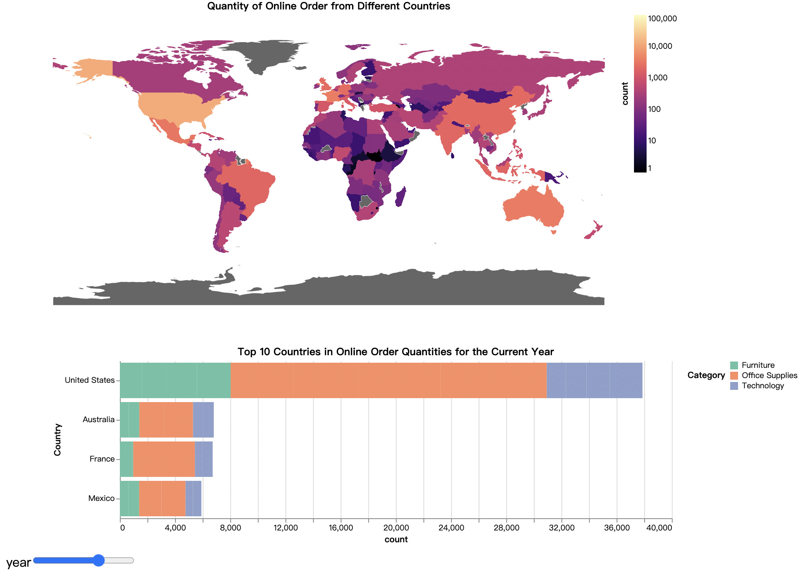
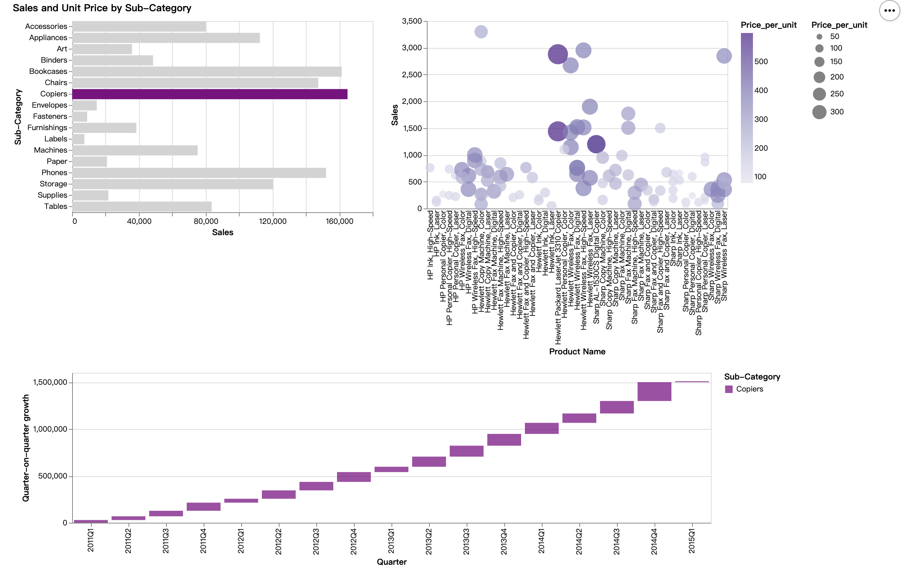
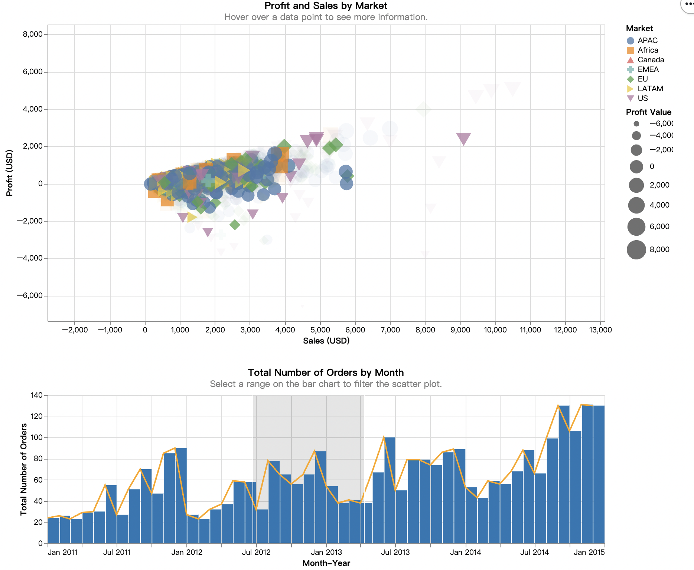

# Global_Superstore_Infor_DataVisualization

## Altair Generated HTML Static Screenshots

In this project, we use [Altair](https://altair-viz.github.io/) for creating data visualization charts.

The following three systems are static screenshots generated from HTML created by Altair. You can download these images and interact with them. Each system corresponds to a .ipy file, such as "SystemA.html."

1. System A
 
   
   - [Download the original HTML for System A](SystemA.html)

2. System B
 
   
   - [Download the original HTML for System B](SystemB.html)

3. System C
 
   
   - [Download the original HTML for System C](SystemC.html)

You can click on the download links above for each system's original HTML to access the interactive versions that allow for changes. The corresponding .ipy files can be viewed for further reference.
